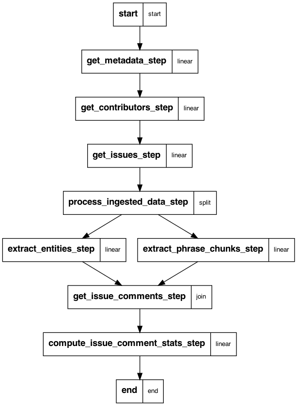

### Workflow

### Usage 

#### Show the workflow steps

python workflow.py show

#### Run the workflow

python workflow.py run --infra ['databricks'|'local'] 

#### Resume a workflow

python workflow.py run --resume

#### Generate workflow graph from metaflow using 

python workflow.py output-dot | dot -Tpng -o graph.png

#### Run metaflow check to make sure that the flow works
	
python workflow.py check
